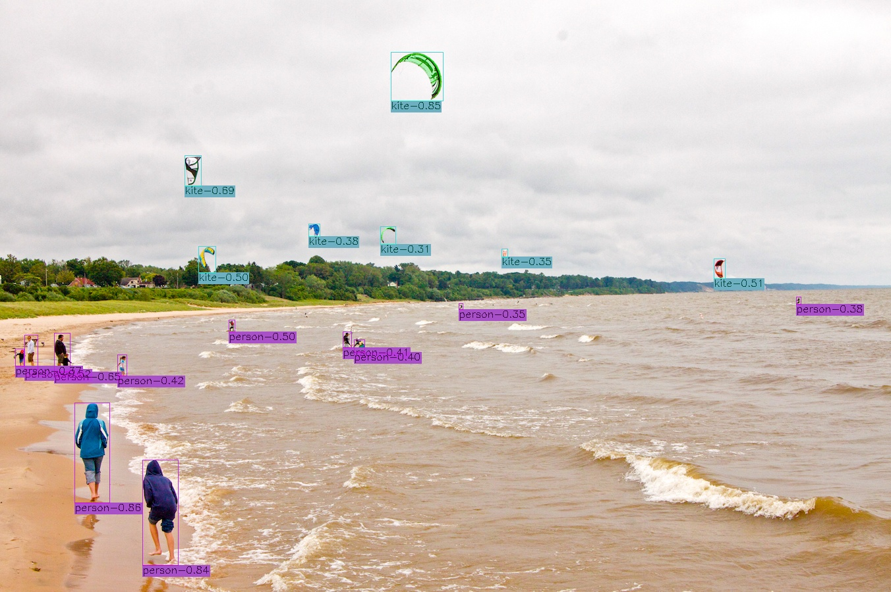

# EfficientDet
This is an implementation of [EfficientDet](https://arxiv.org/pdf/1911.09070.pdf) for object detection on Keras and Tensorflow. 
The project is based on the official implementation [google/automl](https://github.com/google/automl), [fizyr/keras-retinanet](https://github.com/fizyr/keras-retinanet)
and the [qubvel/efficientnet](https://github.com/qubvel/efficientnet). 

## About pretrained weights
* The pretrained EfficientNet weights on imagenet are downloaded from [Callidior/keras-applications/releases](https://github.com/Callidior/keras-applications/releases)
* The pretrained EfficientDet weights on coco are converted from the official release [google/automl](https://github.com/google/automl).

Thanks for their hard work.
This project is released under the Apache License. Please take their licenses into consideration too when use this project.

**Updates**
- [03/21/2020] Synchronize with the official implementation. [google/automl](https://github.com/google/automl)
- [03/05/2020] Anchor free version. The accuracy is a little lower, but it's faster and smaller.For details, please refer to [xuannianz/SAPD](https://github.com/xuannianz/SAPD)
- [02/20/2020] Support quadrangle detection. For details, please refer to [README_quad](README_quad.md)

## Train
### build dataset 
1. Pascal VOC 
    * Download VOC2007 and VOC2012, copy all image files from VOC2007 to VOC2012.
    * Append VOC2007 train.txt to VOC2012 trainval.txt.
    * Overwrite VOC2012 val.txt by VOC2007 val.txt.
2. MSCOCO 2017
    * Download images and annotations of coco 2017
    * Copy all images into datasets/coco/images, all annotations into datasets/coco/annotations
3. Other types please refer to [fizyr/keras-retinanet](https://github.com/fizyr/keras-retinanet))
### train
* STEP1: `python3 train.py --snapshot imagenet --phi {0, 1, 2, 3, 4, 5, 6} --gpu 0 --random-transform --compute-val-loss --freeze-backbone --batch-size 32 --steps 1000 pascal|coco datasets/VOC2012|datasets/coco` to start training. The init lr is 1e-3.
* STEP2: `python3 train.py --snapshot xxx.h5 --phi {0, 1, 2, 3, 4, 5, 6} --gpu 0 --random-transform --compute-val-loss --freeze-bn --batch-size 4 --steps 10000 pascal|coco datasets/VOC2012|datasets/coco` to start training when val mAP can not increase during STEP1. The init lr is 1e-4 and decays to 1e-5 when val mAP keeps dropping down.
## Evaluate
1. PASCAL VOC
    * `python3 eval/common.py` to evaluate pascal model by specifying model path there.
    * The best evaluation results (score_threshold=0.01, mAP50) on VOC2007 test are: 

    | phi | 0 | 1 |
    | ---- | ---- | ---- |
    | w/o weighted |  | [0.8029](https://drive.google.com/open?id=1-QkMq56w4dZOTQUnbitF53NKEiNF9F_Q) |
    | w/ weighted | [0.7892](https://drive.google.com/open?id=1mrqL9rFoYW-4Jc57MsTipkvOTRy_EGfe) |  |
2. MSCOCO
    * `python3 eval/coco.py` to evaluate coco model by specifying model path there.
    
    | phi | mAP |
    | ---- | ---- |
    | 0 | 0.334 [weights](https://drive.google.com/open?id=1MNB5q6rJ4TK_gen3iriu8-ArG9jB8aR9), [results](https://drive.google.com/open?id=1U4Bdk4C7aNF7l4mvhh2Oi8mFpttEwB8s) |
    | 1 | 0.393 [weights](https://drive.google.com/open?id=11pQznCTi4MaVXqkJmCMcQhphMXurpx5Z), [results](https://drive.google.com/open?id=1NjGr3yG3_Rk1xVCk4sgVelTZNNz_E2vp) |
    | 2 | 0.424 [weights](https://drive.google.com/open?id=1_yXrOrY0FDnH-d_FQIPbGy4z2ax4aNh8), [results](https://drive.google.com/open?id=1UQP8kDj7tXHC2bs--Aq8x7w7FkVX4xJD) |
    | 3 | 0.454 [weights](https://drive.google.com/open?id=1VnxoBpEQmm0Z2uO3gjhYDeu-rNirba6c), [results](https://drive.google.com/open?id=1uruTEMPhl_JvbA_T9kCdutzeOR3gFX4g) |
    | 4 | 0.483 [weights](https://drive.google.com/open?id=1lQvTpnO_mfkHCRpcP28dxU4CWyK3xUzj), [results](https://drive.google.com/open?id=1s4nmgYaPqjbAgDlRF1AVVz6uWKDz7O_i) |

## Test
`python3 inference.py` to test your image by specifying image path and model path there. 

